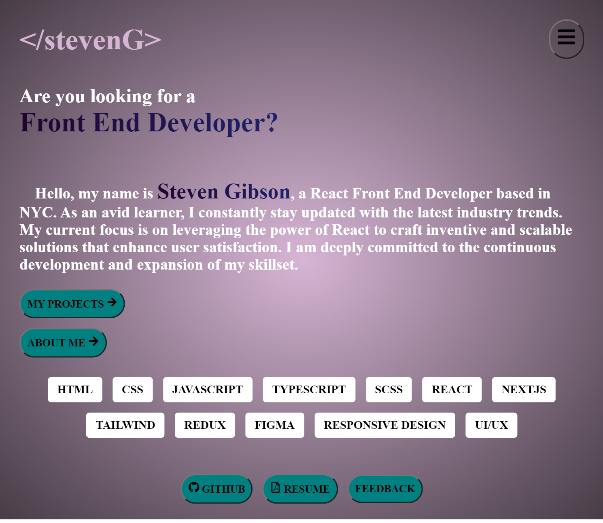

# My Portfolio

An interesting project that allows me to showcase my skills to prospective employers.

 <a target="_blank" href="https://steveng.vercel.app/"> Live Demo </a> 

---
## Table Of Contents
  - [Overview](#overview)
  - [Development](#development)
  - [Challenges](#challenges)
  - [Conclusion](#conclusion)
---

## Overview

Utilizing modern techniques, this project was created with the goal of showcasing my skills to prospective employers. It also demonstrates my commitment to staying updated with the latest industry trends and technologies.

 

### 

## Development

### **Tech stack**

For this project, I chose to use `React` because it has a vast ecosystem of libraries and a supportive community. It allowed me to create reusable components, which made my development process faster and easier.

I opted to utilize `Next.js` as the build tool. This decision was motivated not only by my desire to explore new technologies but also by the compelling benefits it offers, particularly in terms of server-side rendering capabilities. As I intend to maintain and evolve the project over time, adopting Next.js aligns with the current industry best practices recommended by the official React team.

I employed `TypeScript` instead of regular JavaScript because of TypeScript's strong type system and static checking capabilities, which allowed me to catch errors early on and makes the code more reliable. The decision to leverage Typescript, gave me more confidence in the stability of the project.

For styling, I used `SCSS modules`. Its nested syntax provided a more readable and organized structure for defining styles. This contributed to easier code maintenance and enhanced the overall maintainability of the project.

Overall, these choices made my project more efficient, reliable, and organized.

## Challenges

##### **Migration To NextJS**

- After careful consideration, I made the decision to migrate my portfolio from Vite to Next.js. While Vite served as the initial foundation, I realized the importance of seamless updates over time as I intend to maintain and improve upon my portfolio overtime. Next.js stood out to me due to its powerful server-side rendering capabilities and the convenience it offers in creating new pages using markdown files. In addition, following recent trends, Next.js is the primary framework recommended by the Official React Team for building React applications. This transition allows for enhanced flexibility and efficiency in managing and expanding my portfolio.

- This strategic decision was made early on in the project, enabling me to take proactive measures in addressing potential challenges and swiftly resolving any errors. As a first-time user of the framework, I began to immerse myself in understanding its fundamental concepts, laying a strong foundation during this pivotal stage of development.

##### **Responsiveness**

- Upon initially uploading and assessing the application on my mobile device, I observed multiple instances where elements were improperly positioned, leading to a lack of coherence in conveying the intended design. To address this concern and ensure a more responsive user experience, I employed a series of practical measures.

- Firstly, I implemented multiple media queries to adapt the application's layout across different screen sizes, primarily at a breakpoint at 768 pixels. Additionally, I converted pixel-based elements to more flexible units like em/rem, allowing for proportional scaling. Furthermore, I conducted thorough testing using various emulated devices in the developer tools, including some that I personally added, which aided in identifying and resolving my design flaws.

- These efforts not only rectified the issues I experienced but also enriched my understanding of CSS positioning best practices, contributing to the overall improvement of the codebase.

## Conclusion

In conclusion, this project served as an excellent opportunity for me to explore and experiment with new techniques and delve deeper into various aspects of front-end development. It allowed me to expand my skill set and gain valuable insights into emerging trends and technologies within the field. Through this project, I was able to broaden my knowledge and enhance my proficiency, equipping me with a solid foundation for tackling more complex front-end challenges in the future.
